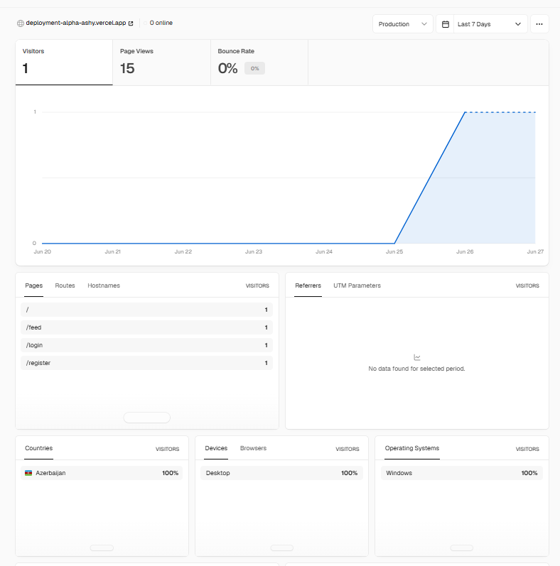
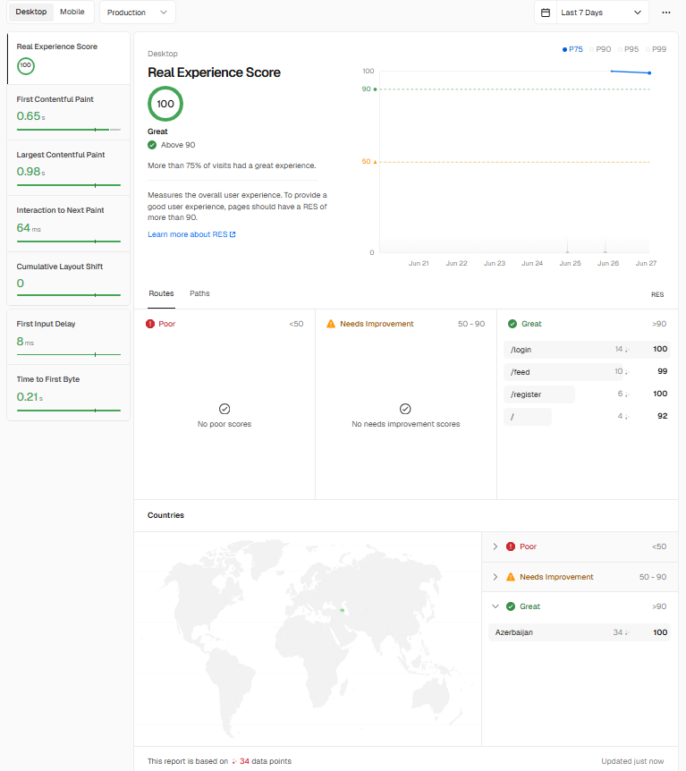

# Pulse — Enterprise Social Platform

A backend-focused social platform built for the Qwasar Enterprise Backend
Integration Platform project. Domain: **Social Platform (Meta-style)**.

## Why this domain

A social platform exercises every pattern the assignment asks for in a way
that's easy to reason about: a feed that needs cursor pagination and
real-time-ish updates, write paths (posts, comments, likes, follows,
messages) that need validation and authorization, and a natural place for
role-based access (`USER`, `MODERATOR`, `ADMIN`) via content moderation
(soft-removing reported posts).

## Stack

- **Next.js 14** (App Router, Server Components + Server Actions)
- **TypeScript** end to end
- **Prisma** ORM against **MySQL**
- **JWT auth from scratch** (access + refresh tokens, httpOnly cookies)
- **Zod** for request validation
- **SWR** (`useSWR`, `useSWRInfinite`) for client data fetching/caching
- **Tailwind CSS** for styling

## Data model

`User`, `Post`, `Comment`, `Like`, `Follow`, `Message`, `Report`. See
`prisma/schema.prisma` for the full schema, indexes, and relations.

## Setup

1. **Install dependencies**

   ```bash
   npm install
   ```

2. **Set up MySQL**

   Create a database (locally, in Docker, or with a managed provider like
   PlanetScale/Railway):

   ```sql
   CREATE DATABASE social_pulse;
   ```

3. **Configure environment variables**

   ```bash
   cp .env.example .env
   ```

   Edit `.env` and set:
   - `DATABASE_URL` — your MySQL connection string
   - `JWT_ACCESS_SECRET` / `JWT_REFRESH_SECRET` — generate with:
     ```bash
     node -e "console.log(require('crypto').randomBytes(64).toString('hex'))"
     ```

4. **Generate the Prisma client & push the schema**

   ```bash
   npx prisma generate
   npx prisma db push
   ```

5. **Run the dev server**

   ```bash
   npm run dev
   ```

   Visit `http://localhost:3000`.

## Project structure

```
app/
  api/
    auth/        register, login, logout, refresh, me
    posts/       feed CRUD, like, comments
    users/       profile, follow
    messages/    direct messages between two users
  actions/       Server Actions (createPostAction, updateProfileAction)
  feed/          main feed page (protected)
  profile/[username]/
  messages/[username]/
  posts/[id]/
  settings/
  login/ register/
lib/
  prisma.ts      Prisma client singleton
  jwt.ts         sign/verify access + refresh tokens
  password.ts    bcrypt hash/compare
  auth.ts        request -> authenticated user, role guards
  api-error.ts   central error -> HTTP response mapping
  validators.ts  Zod schemas
  rate-limit.ts  in-memory rate limiter for auth endpoints
  contexts/AuthContext.tsx
middleware.ts    route protection (redirects unauthenticated users)
```

## Authentication design

- **Access token**: short-lived (15 min), sent as an httpOnly cookie *and*
  accepted via `Authorization: Bearer` header (so the same API works for
  the browser app and any external API client).
- **Refresh token**: longer-lived (7 days), httpOnly cookie only, used via
  `POST /api/auth/refresh` to mint a new access token.
- Passwords hashed with bcrypt (12 salt rounds).
- Login/register are rate-limited per IP to slow down brute-forcing.
- Role-based authorization (`USER` / `MODERATOR` / `ADMIN`) gates
  moderation actions like removing someone else's post.

## API overview

| Method | Route | Description |
|---|---|---|
| POST | `/api/auth/register` | Create account |
| POST | `/api/auth/login` | Log in, sets cookies |
| POST | `/api/auth/logout` | Clear cookies |
| POST | `/api/auth/refresh` | Rotate access token |
| GET | `/api/auth/me` | Current user |
| GET | `/api/posts` | Feed, cursor-paginated |
| POST | `/api/posts` | Create post |
| GET/PUT/DELETE | `/api/posts/:id` | Read/update/delete a post |
| POST/DELETE | `/api/posts/:id/like` | Like/unlike |
| GET/POST | `/api/posts/:id/comments` | List/add comments |
| GET/PUT | `/api/users/:username` | View/edit profile |
| POST/DELETE | `/api/users/:username/follow` | Follow/unfollow |
| GET/POST | `/api/messages/:username` | Conversation thread |

## Known limitations / next steps

- Messaging uses polling (4s interval) rather than WebSockets — fine for a
  demo, would swap for a real-time transport (e.g. Pusher, or a Socket.io
  server) at scale.
- Rate limiting is in-memory and per-instance; a multi-server deployment
  would need a shared store (Redis).
- No file upload for avatars/post images yet — `avatarUrl`/`imageUrl` are
  plain URL fields.

## Deployment

### Hosting & database

| Service | Choice | Why |
|---|---|---|
| Hosting | **Vercel** | Zero-config Next.js deploys, automatic preview URLs per branch, no hosting provider was mandated by the assignment. |
| Database | **TiDB Serverless** | Speaks the MySQL wire protocol, so `schema.prisma` needs zero changes. PlanetScale was the obvious first choice but no longer has a free tier (confirmed on their pricing page — paid plans start at $5/month). |

### Setup

1. **Database** — create a free **Serverless** cluster at
   [tidbcloud.com](https://tidbcloud.com), copy the connection string
   from the "Connect" panel (Prisma format), and set it as
   `DATABASE_URL`.
2. **Vercel** — import the repo at
   [vercel.com/new](https://vercel.com/new). Add `DATABASE_URL`,
   `JWT_ACCESS_SECRET`, `JWT_REFRESH_SECRET`, `JWT_ACCESS_EXPIRES_IN`,
   `JWT_REFRESH_EXPIRES_IN` under **Project Settings → Environment
   Variables** — set separate values for Preview and Production so
   staging never touches production data.
3. **GitHub Actions secrets** — add `VERCEL_TOKEN`,
   `VERCEL_ORG_ID`, `VERCEL_PROJECT_ID` (get the last two by running
   `vercel link` locally) so `.github/workflows/deploy.yml` can deploy
   on your behalf.
4. **Approval gate** — in GitHub repo → Settings → Environments,
   create a `production` environment and add required reviewers. This
   means a push to `main` won't go live until someone approves it.

### Branching → environment mapping

This matches the project's existing two-remote habit
(`origin/dev` for Qwasar, `github/main` for GitHub):

- `dev` → auto-deploys to **staging** on every push (`deploy-staging` job).
- `main` → deploys to **production**, gated behind manual approval
  (`deploy-production` job).

### CI/CD pipeline

`.github/workflows/ci.yml` runs on every push/PR to `main`/`dev`:
lint → production build (with dummy env vars, since `next build` never
opens a real DB connection) → `npm audit`.

`.github/workflows/deploy.yml` runs only on pushes to `main`/`dev`:
builds with real Vercel environment variables, deploys, and for
production specifically, hits `/api/health` afterward to confirm the
live deployment can actually reach the database before calling the
deploy successful.

### Monitoring

- `GET /api/health` — returns `200` with DB status if `SELECT 1`
  succeeds, `503` otherwise. Point any uptime monitor at this.
- Core Web Vitals (LCP, CLS, INP, FCP, TTFB) are beaconed from every
  page load to `POST /api/metrics` via `WebVitalsReporter` (mounted in
  `app/layout.tsx`), currently logged to Vercel's function logs.
- **Vercel Analytics** and **Speed Insights** are enabled on the
  production deployment (`@vercel/analytics`, `@vercel/speed-insights`,
  mounted in `app/layout.tsx`):

  **Analytics** — visitors, page views, top routes, geography:

  

  **Speed Insights** — Real Experience Score of 100 ("Great") on
  production, with sub-second paint times on every route:

  

  | Metric | Value |
  |---|---|
  | Real Experience Score | 100 (Great) |
  | First Contentful Paint | 0.65s |
  | Largest Contentful Paint | 0.98s |
  | Interaction to Next Paint | 64ms |
  | Cumulative Layout Shift | 0 |
  | Time to First Byte | 0.21s |

### Security headers

`next.config.mjs` sets CSP, HSTS, X-Frame-Options, X-Content-Type-Options,
Referrer-Policy, and Permissions-Policy globally — these were absent
from the original config and needed to be added for production.

